# ペチ島

コードだけで描いた3Dの「ペチ島」。ペチ隊長・ヒロミーヌ・ミラ（ロボット）が島をぐるぐる歩き回ります。
画像ファイルは使っていません。島の形・木・キャラクターはすべて SVG とJavaScriptで描いています。

公開ページ: https://hirominemoto.github.io/pechi-island/

物語: https://note.com/quick_gibbon9234/n/n1272e8d9843b

## ファイル

| ファイル | 中身 |
| --- | --- |
| `index.html` | ウェブに置くページ。これ1つで動きます |
| `pechi-island.svg` | SVG単体版。ブラウザで直接開いても動きます |
| `src/` | 元のコード（地形・小物・キャラクター・動き） |
| `build.mjs` | `src/` から上の2つを作り直すスクリプト |

## ウェブに置く

`index.html` をそのままアップロードすれば動きます（GitHub Pages、Netlify など）。

SVG を自分のページに貼る場合:

```html
<!-- 画像として貼る: キャラクターは歩くが、回したり操作したりはできない -->


<!-- 操作もできるように貼る -->
<iframe src="pechi-island.svg" width="800" height="460" style="border:0"></iframe>
```

## 遊び方

- ドラッグ: 島を回す（上下で見下ろす角度）
- ホイール / ピンチ: 拡大・縮小
- 名札のボタン: そのキャラクターを追いかける
- 右上の「昼・夕暮れ・夜」: 時間帯を切りかえる。夕暮れは西の空に金星、夜は星空とときどき流れ星。夜は雲が晴れて、島の向こうに花火があがり、キャラクターもときどき「たまや〜！」と声をかける
- うずまきボタン: ヒロミーヌが台風になる（どの時間帯でも使える）
- キャラクターをタップ: しゃべる
- 山のふもとの洞窟: 奥に青白い光（発光チューブ）。暗がりにはふたつの目が光っていて、ときどきゆっくりまばたきする。夜はいちばんよく見える
- セリフのふきだしは、看板やボタンにかからない場所へ自動でよける

URL の最後に `#dusk`（夕暮れ）や `#night`（夜）を付けると、その時間帯で開きます。
端末を動きを減らす設定（iPhone の「視差効果を減らす」など）にしているときは、花火は出しません。
SVG 単体版（`pechi-island.svg`）を直接開いたときは、右下の丸いボタンで時間帯と台風を切りかえます。

## 作り直す

`src/` を書きかえたら:

```bash
node build.mjs
```
